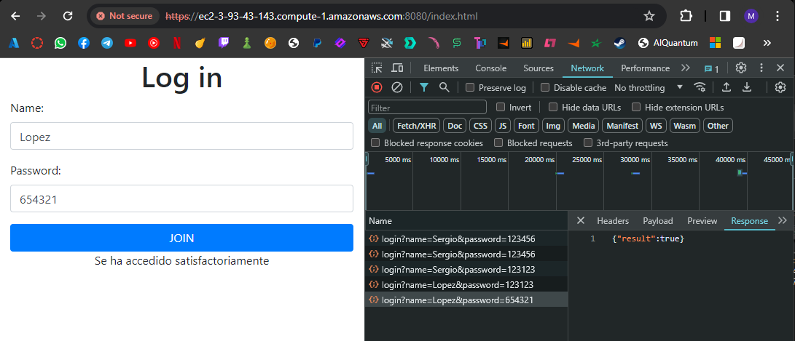
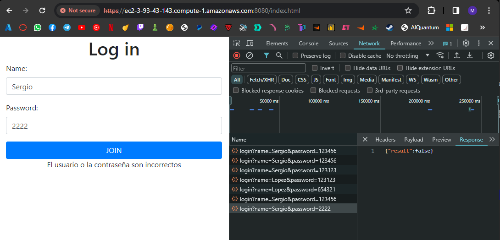
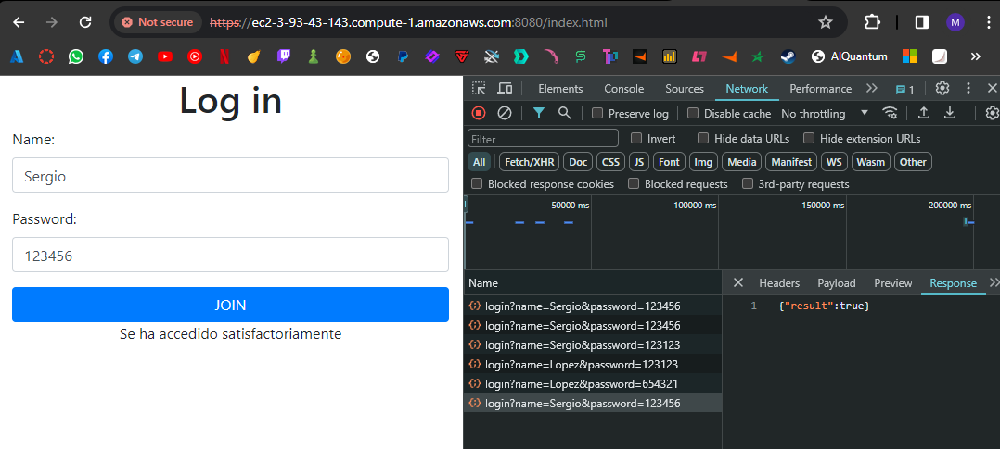

### Sergio Daniel Lopez Vargas

# AREP_Taller7

## Introducción

El código proporcionado es parte de una aplicación de servicio de registro (LogService) 
que utiliza MongoDB como base de datos para almacenar registros. La aplicación consta de 
varias clases que interactúan para permitir la adición de registros a la base de datos y 
la recuperación de los registros almacenados. Además, hay una clase llamada ServiceInvoker 
que se utiliza para invocar servicios de registro externos. El objetivo general de la 
aplicación parece ser proporcionar un servicio centralizado para el registro de eventos 
o mensajes.

## Características y Funcionalidades:

* **LogList:** Esta clase se utiliza para manejar la lista de registros. Permite agregar nuevos registros a la base de datos MongoDB y recuperar una lista de los últimos registros ordenados por fecha. Los registros se representan como documentos JSON en la base de datos.

* **LogService:** Es la clase principal que inicia el servicio de registro. Utiliza Spark framework para manejar las solicitudes HTTP entrantes. Cuando recibe una solicitud GET en la ruta '/service', agrega un nuevo registro a la base de datos utilizando la fecha actual y el mensaje proporcionado en los parámetros de la solicitud. Luego devuelve una lista de registros en formato JSON como respuesta.

* **LogServiceFacade:** Esta clase también inicia un servicio de registro, pero actúa como un intermediario entre el cliente y los servicios de registro externos. Utiliza Spark framework para manejar las solicitudes HTTP entrantes en la ruta '/logs'. La clase invoca servicios de registro externos utilizando la clase ServiceInvoker y devuelve la respuesta al cliente.

* **MongoDBconnection:** Es una clase de utilidad que proporciona una conexión a la base de datos MongoDB.

* **ServiceInvoker:** Esta clase se utiliza para invocar servicios de registro externos. Recibe un array de URLs de servicios de registro y, cuando se invoca, realiza una solicitud GET a la URL correspondiente, pasando un mensaje como parámetro en la solicitud. Luego devuelve la respuesta del servicio de registro externo.


## Arquitectura

La arquitectura de la aplicación es una arquitectura basada en microservicios,
donde cada microservicio se encarga de una función específica. Hay un servicio de
registro principal (LogService) que gestiona las solicitudes internas y otro
servicio de fachada (LogServiceFacade) que gestiona las solicitudes externas y
actúa como un intermediario. Además, hay un servicio de invocación (ServiceInvoker)
que se utiliza para comunicarse con servicios de registro externos. La base de datos
MongoDB se utiliza para almacenar los registros. La aplicación utiliza Spark
framework para manejar las solicitudes HTTP entrantes y salientes.


## Instrucciones de Ejecución
* Clone el repositorio desde GitHub:

```
git clone https://github.com/sergiolopezzl/AREP_Taller7.git
```

* Navegue al directorio del proyecto: 

```
cd AREP_Taller7
```

* Compile el proyecto y descargue las dependencias con Maven: 

```
mvn clean package
```

* Ejecuta el 1 servicio con el siguiente comando: 

```
mvn exec:java '-Dexec.mainClass=com.example.login.LoginService'
```

* Ejecuta el 2 servicio con el siguiente comando: :

```
mvn exec:java '-Dexec.mainClass=com.example.login.UsersService'
```

* Entre a la pagina mediante este link si es Localmente:

```
https://localhost:8080/index.html
```

* Entre a la pagina mediante este link si esta la instancia EC2:

```
http://ec2-3-84-133-29.compute-1.amazonaws.com:38000/index.html
```


## Ejemplo de desarrollo

### Pruebas

* Video

[](https://www.youtube.com/watch?v=BXyCjFyGHB0)

* AWS



* LOCAL



* Pruebas unitarias




